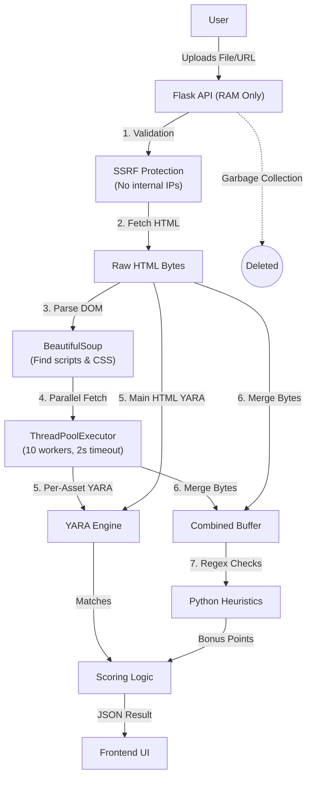

# Deep Dive: Architecture, Security & Internals

This document provides a comprehensive technical breakdown of the malware scanner's architecture, mapping the conceptual logic directly to the source code files (`page.tsx`, `Scanner.tsx`, `index.py`).

---

## 📂 Codebase Walkthrough

To understand how the scanner works, we must look at how data flows through the specific files in the project.

### 1. The Visual Container: `src/app/page.tsx`
This file is the **entry point** for the application's frontend.
- **Role**: It establishes the "Cyber/Security" aesthetic and handles the initial page load.
- **Key Logic**:
  - **Layout**: It creates the background environment using CSS classes like `.bg-mesh` and `.grid-overlay` to give the "hacker terminal" feel.
  - **Orchestration**: It imports the `Scanner` component and places it centrally.
  - **Animation**: It uses `framer-motion` to sequence the entrance animations (Title fades in `->` Subtitle fades in `->` Scanner slides up).

### 2. The Brain: `src/components/Scanner.tsx`
This component handles all user interaction and client-side logic.
- **Role**: It captures user input, simulates the specific "scanning" experience, and visualizes the results.
- **Key Steps**:
  1.  **Input Capture**: It manages state for the File Upload (Drag & Drop) and URL Input text field.
  2.  **Simulation (`simulateLogs`)**: When you click "Scan", this function triggers a timer that generates "fake" progress logs (e.g., *"Resolving host...", "Handshake established..."*). This provides immediate visual feedback while the actual server processes the request.
  3.  **API Handoff (`handleScan`)**: It packages the file/URL into a `FormData` object and sends an asynchronous `POST` request to `/api/scan`.
  4.  **Result Rendering**: When the JSON response arrives:
      - It calculates the color-coded **Severity Gauge**.
      - It maps technical rule names (e.g., `WEB_JS_Obfuscation`) to human-readable explanations using the `threatDescriptions.ts` data file.

### 3. The Engine: `api/index.py`
This is the serverless backend (Flask) that performs the heavy lifting.
- **Role**: It safely fetches content, executes the analysis engine, and calculates risk scores.
- **Key Functions**:
  - **`is_safe_url(url)`**: A security function that resolves a hostname to an IP address. It strictly blocks internal IP ranges (like `127.0.0.1` or `192.168.x.x`) to prevent **SSRF** (Server-Side Request Forgery) attacks.
  - **`scan()` Route**:
    - **URL Mode**: It uses `requests.get()` to fetch the raw HTML bytes. Then, it uses `BeautifulSoup` to find all linked `<script>` and CSS files, downloading and scanning them **in parallel** using a thread pool.
    - **File Mode**: It reads the raw bytes directly from the request stream into memory.
  - **`rules.match()`**: It runs the compiled **YARA** engine against the memory buffer to find signature matches.
  - **Heuristics**: It runs Python-based Regex checks for patterns like "Redirect Chains" or "Excessive Obfuscation" that YARA might miss.

### 4. The Ruleset: `api/rules/malware.yar`
This file contains all YARA detection signatures, organized into two categories:
- **Web-Focused Rules**: Detect threats in HTML/JS/CSS content from URL scans (e.g., phishing keywords, hidden iframes, obfuscated JavaScript, forced downloads).
- **PE/Executable Family Rules**: Detect known malware families (Emotet, Ryuk, LockBit, WannaCry, etc.) in uploaded `.exe` files. These all require the `MZ` PE header, so they never produce false positives on web content.

---

## 🔒 Security & Privacy: Is it Safe?

A common concern with online scanners is safety: *"If I upload a virus, will I get hacked? Will the server get infected?"*

### 1. Passive Scanning (No Execution)
The most critical security feature of this scanner is that it is **passive**.
- **How it works**: The scanner treats every input (PDF, EXE, DOCX) as a raw stream of bytes (0s and 1s). It **never executes**, runs, or renders the file.
- **Why you are safe**: Malware requires execution to function. A malicious PDF needs a vulnerable PDF reader to trigger its payload. Since our backend only reads the text/binary patterns without rendering the page, the exploit code remains inert harmless text.
- **The Sandbox**: The scanning process runs in a short-lived, isolated serverless environment that is destroyed immediately after the request finishes.

### 2. Data Ephemerality (RAM Only)
Users often ask: *"How is my file saved? Is it stored in a database?"*
- **In-Memory Processing**: When you upload a file, it is read directly into **Random Access Memory (RAM)** via the `request.files['file'].read()` method.
- **No Disk Storage**: The file is **never written to the hard drive** (`HDD/SSD`). It never touches a database or a file system bucket (like S3).
- **No Cookies/Persistence**: The file extraction is stateless. We do not use cookies, local storage, or sessions to track files.
- **Instant Deletion**: As soon as the `scan()` function returns the JSON result (usually within 1-2 seconds), the memory is freed. The file ceases to exist on our end.

### 3. Anonymity & Scraper Mechanics
*"Will my IP get tracked when I scrape a URL?"*

- **The Proxy Architecture**: The scan relies on the **backend** (Python) to fetch data, not your web browser. This means malicious JavaScript, auto-downloads, or browser exploits cannot run on your machine because the backend only downloads the *source code* without rendering or executing it.

- **IP Anonymity (Cloud vs. Local)**:
  - **Deployed (Production)**: If accessing the live website (hosted on Vercel), the target site sees the **cloud server's IP**, keeping your personal IP hidden.
  - **Localhost (Dev Mode)**: If you are running the code locally on your own machine, the requests originate from **your network**. While you are still safe from code execution (the "Passive Scanning" protection), you **do not** have IP anonymity—the target site will see your IP address.

---

## 🔍 YARA Engine: The Internals

The core of the detection logic is [YARA](https://virustotal.github.io/yara/), a battle-tested tool used by malware researchers to identify malware families.

### 1. How YARA Works (Byte-Level Pattern Matching)
YARA is often described as "grep on steroids." It scans the raw bytes of a file and matches patterns — **it does not convert strings to hex or modify the content in any way.**

Here's what actually happens:
- **Plain Strings**: When a rule defines `$s1 = "<script>" nocase`, YARA searches the raw byte stream for the exact ASCII sequence (`3C 73 63 72 69 70 74 3E`). The `nocase` modifier tells it to also accept uppercase and mixed-case variants. No conversion happens — the file's bytes are compared directly.
- **Wide Strings**: The `wide` modifier matches UTF-16 encoding (each char followed by a null byte: `52 00 79 00 75 00 6B 00 ...`), critical for Windows executables which store strings in UTF-16.
- **Regex Patterns**: Complex expressions like `/window\.location(\.href)?\s*=\s*/` are compiled and matched against the byte stream.
- **Byte-Level Conditions**: `uint16(0) == 0x5A4D` reads the file's first 2 bytes to check for the `MZ` PE header, ensuring a rule only fires on actual Windows executables.

**The Aho-Corasick Algorithm**: YARA compiles all strings from all rules into a single state machine, scanning the file in a **single linear pass** (O(n)). This means scanning for 100 rules takes roughly the same time as scanning for 1.

### 2. What We Scan For
Our integration (`api/rules/malware.yar`) contains two categories of signatures:

**Web-Focused Rules** (trigger on URL scans — no PE header requirement):

| Signature Type | Technical Detail | Why It's Flagged |
|:---|:---|:---|
| **Obfuscated JS** | `eval(String.fromCharCode(...))` + encoded blobs | Detects code hiding its payload by decoding at runtime |
| **Phishing Keywords** | "verify your account", "update payment" | Social engineering phrases used to steal credentials |
| **Hidden Iframes** | `<iframe width=0 height=0>` | Invisible iframes used for drive-by downloads |
| **Redirect Chains** | Multiple `window.location =` or `meta refresh` | Pages that bounce users through URLs to hide the destination |
| **Forced Downloads** | Blob URLs + `a[download]` + `.click()` | Scripts that trigger file downloads without user consent |
| **Permission Abuse** | `Notification.requestPermission` + push subscribe | Pages requesting notification permissions to spam users |

**PE/Executable Family Rules** (trigger only on uploaded files with the `MZ` header):

| Family | Type | Key Signatures |
|:---|:---|:---|
| **Emotet** | Banking Trojan | `Global\EMOTET` mutex, specific IE7 User-Agent |
| **Ryuk** | Ransomware | `RyukReadMe.txt`, `.RYK` extension |
| **LockBit** | Ransomware | `Restore-My-Files.txt`, `.lockbit` extension |
| **WannaCry** | Ransomware | `WannaDecryptor`, `mssecsvc.exe` |
| **TrickBot** | Banking Trojan | `TrickLoader`, C2 config fields |
| **QakBot** | Banking Trojan | `CoreDll.dll`, botnet identifiers |
| **AgentTesla** | Spyware | SMTP exfiltration strings |
| **RedLine** | Infostealer | `passwords.txt`, `wallet.dat` targets |
| **DarkComet** | RAT | `DC_MUTEX`, `DCRAT` identifiers |
| **Cobalt Strike** | Post-Exploitation | `ReflectiveLoader`, beacon C2 strings |

> **Important**: The PE family rules all require `uint16(0) == 0x5A4D` — the Windows executable header. This means a news article containing the word "LockBit" will **not** trigger a false positive. Only actual PE binaries with those strings embedded in them will match.

### 3. Testing & Rule Scalability
- **Compilation**: On server start, `yara.compile()` runs. If the syntax is invalid, the server fails safely (logs error, continues without rules).
- **Matching**: The `rules.match(data=content)` method scans the entire byte buffer. It returns a list of *every* rule that satisfied its condition.
- **Transparency**: The backend parses the raw `.yar` file and stores each rule's source text. When a rule matches, the full YARA source is included in the API response, allowing the frontend to show users exactly why a file was flagged.
- **Adding New Rules**: Simply add a new `rule` block to `malware.yar` and restart the server — no code changes needed. The backend automatically discovers and indexes the new rule.

---

## 🛠 The Pipeline: Step-by-Step

Here is the exact lifecycle of a scan request (`api/index.py`):

### Phase 1: Ingestion
1. **Input**: User sends POST request to `/api/scan`.
2. **Type Check**: Backend determines if it's a `file` (multipart/form-data) or `url` (string).
3. **SSRF Guard**: If URL, the `is_safe_url()` function resolves the hostname.
   - *Security Check*: usage of `socket.gethostbyname` checks if the IP is private (e.g., `127.0.0.1` or `192.168.1.1`). If so, it **aborts**. This prevents attackers from using our scanner to map our internal network.

### Phase 2: Extraction & Fetching
- **For Files**: Raw bytes are read into variable `content` via `f.read()`.
- **For URLs**:
  1. `requests.get()` pulls the raw HTML bytes.
  2. `BeautifulSoup` parses the DOM tree.
  3. **Asset Discovery**: The scanner finds all `<script src="...">` (up to 10) and `<link href="...">` (up to 10) tags.
  4. **Parallel Fetching & Scanning**: A `ThreadPoolExecutor` with 10 workers fetches and YARA-scans each asset concurrently. Each worker:
     - Validates the asset URL through `is_safe_url()` (SSRF check)
     - Enforces a 2-second timeout
     - Rejects assets larger than 500KB
     - Runs `rules.match()` on the asset independently
  5. The main HTML is also YARA-scanned separately.
  6. All fetched bytes are merged into a single buffer for heuristic analysis.

### Phase 3: Analysis
1. **YARA Scan**: The byte buffer is passed to the C-based YARA engine.
   - *Output*: List of Rule Names (e.g., `WEB_Forced_Download_High`, `Emotet_Family`) and the specific `strings` that matched, with ±60-character context snippets.
2. **Heuristic Scan**: Python logic runs regex checks for patterns too complex for simple YARA strings:
   - *Count Redirects*: `window.location` ≥ 3 times?
   - *Count Obfuscation*: `eval()` + `unescape()` ≥ 5 times?

### Phase 4: Scoring
The final score is calculated:
`Score = 50 (Base) + (10 × Match_Count) + Heuristic_Bonus`
- Caps at **100**.
- Example: 1 match (`Suspicious_Script`) + 1 Heuristic (`Redirect`) = `50 + 10 + 20 = 80` (High Risk).

### Phase 5: Response
A JSON object is returned to the frontend.
- **Transparency**: We send back the *actual snippets* of code that triggered the alarm, plus the full YARA rule source for each match.
- **Cleanup**: The `content` variable goes out of scope, and Python's garbage collector frees the RAM. Nothing remains.

---

## 📊 Visual Summary

