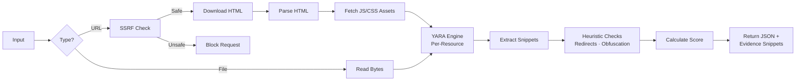

# How It Works: The Malware Detection Pipeline

This document explains the technical logic behind the malware scanner, detailing how the Python backend (`api/index.py`) processes files and URLs to detect threats using YARA rules and behavioral heuristics.

## 1. Request Handling

The scanning logic is hosted on a Flask API route (`/api/scan`). It accepts `POST` requests containing either an uploaded file or a URL string.

- **Files**: The raw binary content is read directly from the upload stream.
- **URLs**: The backend acts as a proxy — it downloads the target website's HTML **and** all linked JavaScript and CSS resources.

## 2. URL Processing Logic

When a URL is submitted, several steps occur:

1. **Protocol Normalization**: If the user omits `http://` or `https://`, we automatically prepend `https://`.
2. **SSRF Protection**: Before making any request, the `is_safe_url()` function resolves the hostname to an IP address. It blocks the request if the IP belongs to a private network (e.g., `127.0.0.1`, `192.168.x.x`) or cloud metadata services (`169.254.169.254`). This protection is applied to the main URL **and** every linked asset.
3. **HTML Fetching**: We use the `requests` library to download the page. SSL verification is **disabled** (`verify=False`).
   - *Why?* Many phishing and malware distribution sites use invalid or self-signed certificates. To detect them, we must inspect their content regardless of certificate errors.
4. **Asset Discovery**: Using BeautifulSoup, we parse the HTML to find:
   - `<script src="...">` tags → linked JavaScript files
   - `<link rel="stylesheet" href="...">` tags → linked CSS files
5. **Asset Fetching**: Each discovered JS/CSS URL is resolved (relative URLs converted to absolute via `urljoin`), checked against SSRF protection, and downloaded with a 3-second timeout. Up to 10 of each type are collected.

## 3. The YARA Engine

The core detection uses the [YARA](https://virustotal.github.io/yara/) pattern-matching engine.

1. **Rule Compilation**: On server startup, the application compiles rules from `api/rules/malware.yar`. These define text/binary patterns (JavaScript functions, PE headers, known malicious strings) with conditions.
2. **Per-Resource Scanning**: Each resource (HTML, every JS file, every CSS file) is scanned **individually** against YARA — not concatenated into one blob. This is critical because many rules include `filesize < 500KB` guards to avoid false positives on large, legitimate production bundles (like YouTube's minified JS).
3. **Evidence Extraction**: For each YARA match, we extract up to 3 code snippets showing ±60 characters of context around the matched pattern. This is returned to the frontend so users can see exactly what triggered the detection.

### Key YARA Rules

| Rule | What It Detects |
|------|----------------|
| `Suspicious_Script` | Combination of `<script>`, `eval()`, `document.write`, and `base64` in a small page |
| `Auto_Redirect` | Multiple `window.location` assignments and `http-equiv="refresh"` |
| `Hidden_Iframe` | Zero-dimension iframes loading invisible webpages |
| `WEB_JS_Obfuscation_Stack_Medium` | `eval()`/`Function()` combined with `atob`/`fromCharCode` and encoded blobs |
| `WEB_Redirect_Primitives_Medium` | Heavy use of `location.replace()`, `location.assign()`, `top.location` |
| `WEB_Forced_Download_High` | Programmatic `<a download>` creation or `Blob`-based file downloads |
| `WEB_Permission_Abuse_Notifications_Push_High` | Aggressive `Notification.requestPermission()` with ad-related patterns |
| `Executable_Header` | Windows PE header (`MZ` magic bytes) |
| `Phishing_Keywords` | Phrases like "verify your account", "update payment", "confirm identity" |

All web-focused rules include a `filesize < 500KB` guard to prevent false positives on large, legitimate sites.

## 4. Heuristic Analysis

In addition to YARA, two Python-based heuristic checks run on the combined content:

1. **Suspicious Redirects**: Counts occurrences of `window.location =` and `http-equiv="refresh"`. Only flags if **3 or more** are found — a single redirect is normal (e.g., after login), but many suggests a redirect chain used in phishing.

2. **Eval/Obfuscation**: Counts occurrences of `eval()`, `unescape()`, and `document.write()`. Only flags if **5 or more** combined occurrences are found — legitimate sites may use one or two, but heavy use indicates deliberate code obfuscation.

Both heuristics extract code snippets (±60 chars of context) for evidence, just like YARA matches.

## 5. Scoring & Results

The raw matches are converted into a risk score:

- **Base Logic**: If 0 matches are found, the score is **0** (Safe).
- **Risk Calculation**: If any matches are found, the score follows this formula:
  - **Base Entry**: **50** points for having at least one match.
  - **Match Multiplier**: **+10** for *every* unique YARA rule or heuristic check that fails.
  - **Heuristic Bonus**: A failed heuristic adds an extra penalty: **+20** for Suspicious Redirects and **+15** for Eval/Obfuscation.
- **Cap**: The final score is constrained between 0 and **100**.

### Severity Levels

| Score | Label | Meaning |
|-------|-------|---------|
| 0–19 | CLEAN | No threats detected |
| 20–49 | LOW RISK | Minor suspicious patterns |
| 50–74 | MEDIUM RISK | Multiple concerning detections |
| 75–100 | HIGH RISK | Strong indicators of malicious intent |

## 6. Structured Response

The API returns a JSON object with:

```json
{
  "score": 70,
  "matches": [
    {
      "rule": "Auto_Redirect",
      "snippets": ["...window.location = 'http://evil.com'..."]
    }
  ],
  "analysis_log": ["✅ Heuristic Passed: ...", "❌ Heuristic Failed: ..."],
  "content_preview": {
    "html": "<!DOCTYPE html>...",
    "js": [{"name": "app.js", "content": "..."}],
    "css": [{"name": "style.css", "content": "..."}]
  },
  "details": "Scanned 45231 bytes from https://example.com"
}
```

- **`matches`**: Array of `{rule, snippets}` objects — each includes the rule name and up to 3 code snippets showing the actual captured evidence.
- **`content_preview`**: For URL scans, a structured object with separate HTML, JS, and CSS sections (displayed in tabs on the frontend). For file uploads, a simple string.
- **`analysis_log`**: Step-by-step log of what the scanner checked, with ✅/❌ indicators.

## 7. Frontend Display

The frontend (`Scanner.tsx`) presents results with:

- **Risk Score Gauge**: Animated circular gauge with color-coded severity.
- **Detection Detail Cards**: Each detection is a clickable card that expands to show:
  - **What This Means**: Plain-language, non-technical explanation of the threat.
  - **Captured Evidence**: The actual code snippets from the scan that triggered the rule.
  - **YARA Rule Source**: The raw source code of the YARA rule itself, providing full transparency.
  - **Learn More**: Link to a relevant Wikipedia/educational article.
- **Analysis Log**: Step-by-step breakdown of every check the scanner ran.
- **Scraped Content Viewer**: Tabbed interface (HTML / JS / CSS) showing the fetched source code.

## Summary Flow


