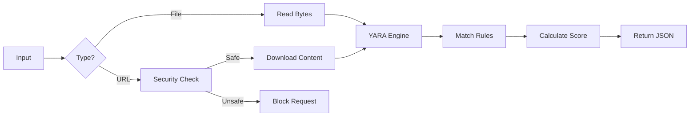

# How It Works: The Malware Detection Pipeline

This document explains the technical logic behind the malware scanner, detailing how the Python backend (`api/index.py`) processes files and URLs to detect threats using YARA.

## 1. Request Handling
The scanning logic is hosted on a simple Flask API route (`/api/scan`). It accepts `POST` requests containing either a uploaded file or a URL string.

- **Files**: The raw binary content is read directly from the upload stream.
- **URLs**: The backend acts as a proxy to download the target website's source code.

## 2. URL Processing Logic
When a URL is submitted, several steps occur before valid content is obtained:

1.  **Protocol Normalization**: If the user omits `http://` or `https://`, we automatically prepend `https://`.
2.  **SSRF Protection**: Before making any request, the `is_safe_url()` function (in `api/security.py`) resolves the hostname to an IP address. It blocks the request if the IP belongs to a private network (e.g., `127.0.0.1`, `192.168.x.x`) or cloud metadata services.
3.  **Content Fetching**: We use the `requests` library to download the page. Crucially, strict SSL verification is **disabled** (`verify=False`).
    - *Why?* Many phishing and malware distribution sites use invalid or self-signed certificates. To detect them, we must inspect their content regardless of certificate errors.

## 3. The YARA Engine
The core of the detection is the [YARA](https://virustotal.github.io/yara/) pattern-matching engine.

1.  **Rule Compilation**: On server startup, the application compiles the YARA rules found in `api/rules/malware.yar`. These rules define text or binary patterns (like specific JavaScript functions, PE headers, or known malicious strings).
2.  **Matching**: The content (whether from a file or a downloaded URL) is passed to `rules.match(data=content)`.
3.  **Analysis**: YARA scans the byte stream for every rule pattern simultaneously. This is extremely fast and capable of handling complex conditions (e.g., "String A must appear near String B").

## 4. Scoring & Results
The raw matches from YARA are converted into a user-friendly risk score:

- **Base Logic**: If 0 matches are found, the score is 0 (Safe).
- **Risk Calculation**: If matches are found, the score starts at 50 and increases by 10 for every additional rule matched, capped at 100.
    - *Note*: This is a simple heuristic. In a production system, different rules would carry different weights (e.g., "Known Ransomware" = 100, "Suspicious Evaluator" = 20).

## Summary Flow

